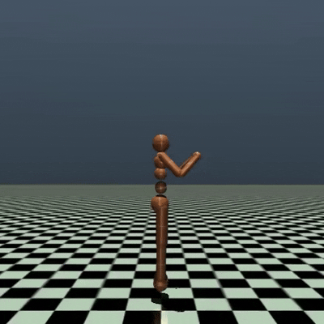

# PPO-Agent für symmetrisches Gehverhalten in Humanoid-v5

## Projektübersicht

Dieses Projekt implementiert einen PPO-Agenten (Proximal Policy Optimization) für eine angepasste Humanoid-v5-Umgebung (basierend auf Gymnasium und Mujoco).  
Der Fokus liegt auf dem Erlernen eines **symmetrischen, stabilen und natürlichen Gangverhaltens** ("walking-only").  

In der Originalumgebung neigen viele Policies dazu, instabile, einbeinige oder stark asymmetrische Gangarten zu entwickeln.  
Durch gezielte Modifikationen an der Reward-Struktur (Symmetrie-Bonus, Anti-Hopping-Penalty, Stabilisierung der Körperhaltung) wird der Agent hier aktiv zu einem menschlich anmutenden Gangverhalten geführt.

## Zielsetzung

- Entwicklung eines PPO-basierten Lernalgorithmus, der die Modifikationen der Humanoid-Umgebung nutzen kann.
- Erzeugung einer robusten und übertragbaren Geh-Policy für den Humanoid-Agenten.
- Qualitative und quantitative Auswertung des Lernfortschritts.

---

## Verwendung

### Voraussetzungen

- Python 3.10+
- PyTorch
- Gymnasium (mit Mujoco-Unterstützung)
- matplotlib
- pandas
- imageio
- tensorboard

### Projektstruktur

```text
env.py         → modifizierte Humanoid-Umgebung (Symmetrie + Anti-Hopping)
ppo.py         → PPO-Agent (Policy + Value-Netzwerke, Update-Loop)
mlp.py         → MLP-Modul für Policy & Value Net
utils.py       → Hilfsfunktionen (RunningNorm, explained_variance, etc.)
main.py        → Trainings-Skript (kompletter Training Loop)
videos/        → gerenderte MP4-Videos & GIFs (optional)
logs/          → Trainings-Logs (CSV + TensorBoard)
plots/         → automatisch generierte Plots während Training
checkpoints/   → gespeicherte Model-Checkpoints
