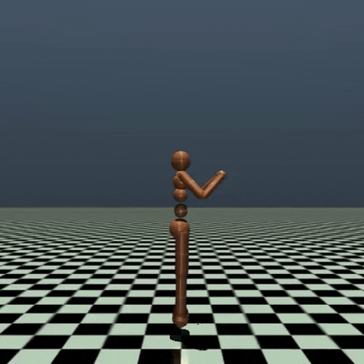

# PPO Agent for Humanoid Locomotion

**Bachelor Thesis · Hochschule München · 2025**  
**Focus:** Reinforcement Learning · PPO · Reward Engineering · Robot Locomotion · MuJoCo

This project was my introduction to **Reinforcement Learning** and investigated how a humanoid robot can learn locomotion using **Proximal Policy Optimization (PPO)**.

The work was conducted as part of my Bachelor's thesis at **Hochschule München** using the `Humanoid-v5` environment from **Gymnasium** and **MuJoCo**.

The main focus was not only on implementing PPO, but on investigating how **reward design influences the behavior learned by the agent**.

---

## Overview

The project uses a modified `Humanoid-v5` environment in which additional reward components were introduced to encourage specific locomotion characteristics.

The experiments investigated whether reward shaping could promote:

- more symmetric locomotion
- reduced hopping and jumping behavior
- improved body stabilization
- forward movement

The complete learning pipeline was implemented and evaluated using a custom PPO agent.

---

## Result

The trained agent successfully learned a behavior that enabled **forward locomotion**.

However, the resulting policy did **not** develop the natural human-like walking pattern that was originally intended.

Instead, the agent converged to a short **stepping / "tippling" behavior**.



This result was an important part of the project: it demonstrated that a reinforcement learning agent can find a locally effective movement strategy that satisfies parts of the reward objective without necessarily producing the desired human-like behavior.

### Key observation

The experiments highlighted the strong influence of **reward engineering** on the resulting policy.

A reward function can successfully optimize the defined objective while still leading to an unintuitive or undesired strategy.

This was one of the main lessons of the project and motivated further interest in how learning algorithms interact with system design and optimization objectives.

---

## Technical Approach

### Reinforcement Learning

The agent uses **Proximal Policy Optimization (PPO)**.

Two neural networks are used:

- **Policy Network** – predicts the actions of the humanoid
- **Value Network** – estimates the expected future return

The PPO implementation includes, among other components:

- clipped policy updates
- advantage estimation
- entropy regularization
- value loss
- gradient clipping
- observation normalization

---

### Custom Humanoid Environment

The original `Humanoid-v5` environment was extended with additional reward components.

The reward design investigated several aspects of the learned movement:

| Reward component | Purpose |
|---|---|
| Forward movement | Encourage locomotion |
| Symmetry | Encourage more balanced movement |
| Anti-hopping | Penalize undesired jumping / hopping |
| Body stabilization | Encourage a more stable posture |

The goal was to guide the learning process toward a stable and more symmetric locomotion strategy.

---

## Reward Engineering

One of the central parts of the project was the design and evaluation of additional reward terms.

The underlying idea was that the agent does not directly know what "natural walking" means. It only optimizes the objective defined by the reward function.

Therefore, seemingly reasonable reward components can interact in unexpected ways.

The experiments showed that the learned policy can exploit these objectives and converge to a movement strategy that is effective according to the reward function, but does not necessarily correspond to the intended behavior.

This provided practical insight into one of the central challenges of reinforcement learning:

> **The quality of the learned behavior is strongly influenced by how the objective is formulated.**

---

## Training Pipeline

The training pipeline was implemented in Python and includes:

1. Environment initialization
2. Observation normalization
3. Action selection using the policy network
4. Rollout collection
5. Advantage estimation
6. PPO optimization
7. Value-function updates
8. Gradient clipping
9. Training monitoring and evaluation

The implementation was designed to allow experiments with different reward configurations and training parameters.

---

## Project Structure

```text
BachelorarbeitHumanoid/
│
├── README.md
├── main.py
├── env.py
├── ppo.py
├── mlp.py
├── utils.py
├── requirements.txt
│
└── Kurzesvideo.gif
